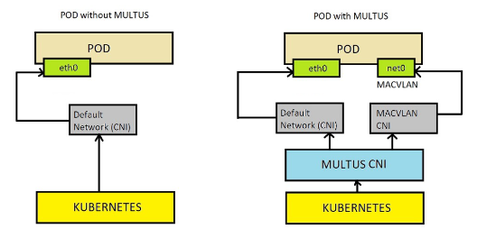
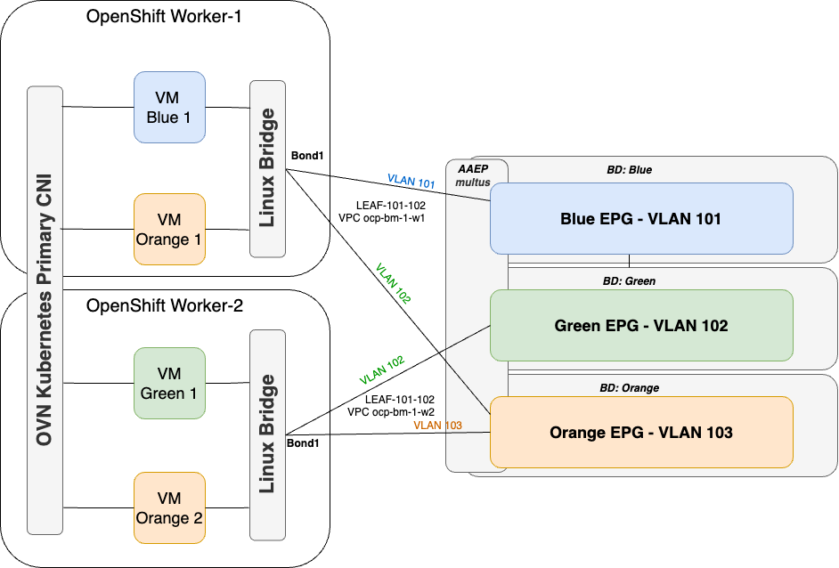

# Cisco Network Operator for Red Hat OpenShift Virtualization 

## Table of Contents

- [OpenShift Virtualization overview](#openShift-virtualization-overview)
  - [Multus CNI](#multus-cni)
- [Cisco Network Operator](#cisco-network-operator)
  - [Cisco Network Operator software architecture](#cisco-network-operator-software-architecture)
  - [User Configurable Custom Resource Definitions (CRDs)](#user-configurable-custom-resource-definitions-crds)
- [Cisco ACI and OpenShift Virtualization Use Case](#cisco-aci-and-openshift-virtualization-use-case)
- [Cisco Network Operator Installation](#cisco-network-operator-installation)
  - [OpenShift Node Interfaces Configuration](#openshift-node-interfaces-configuration)
  - [Preparing Cisco ACI configuration](#preparing-cisco-aci-configuration)
- [Using Cisco Network Operator for OpenShift Virtualization](#using-cisco-network-operator-for-openshift-virtualization)
  - [Creating Network segment for Virtual Machine connectivity](#creating-network-segment-for-virtual-machine-connectivity)
  - [CNI chaining](#cni-chaining)
  - [Creating Virtual Machine](#creating-virtual-machine)
  - [Custom configuration for ACI](#custom-configuration-for-aci)
  - [Extending VLAN Pool](#extending-vlan-pool)
- [Virtual Machine migration from other platforms to OpenShift Virtualization](#virtual-machine-migration-from-other-platforms-to-openshift-virtualization)


# OpenShift Virtualization overview

OpenShift Virtualization is an add-on to OpenShift Container Platform
that allows you to run and manage virtual machine workloads alongside
container workloads. OpenShift Virtualization adds new objects into your
OpenShift Container Platform cluster by using Kubernetes custom
resources to enable virtualization tasks. These tasks include:

-   Creating and managing Linux and Windows virtual machines (VMs)

-   Running pod and VM workloads alongside each other in a cluster

-   Connecting to virtual machines through a variety of consoles and CLI
    tools

-   Importing and cloning existing virtual machines

-   Managing network interface controllers and storage disks attached to
    virtual machines

-   Live migrating virtual machines between nodes

OpenShift virtualization uses KubeVirt technology. For more information
about architecture please refer to [KubeVirt
Documentation](https://kubevirt.io/user-guide/architecture/)


## Multus CNI

Additional interface attachment to the Pod is possible thanks to Multus
CNI. Multus is the open-source project that enables Kubernetes pods to
attach to multiple networks. It receives all commands from kube-api
servers and, depending on the requirements, passes requests for
execution to specific CNI.


Typically, in Kubernetes each pod only has one network interface with
Multus you can create a multi-homed Pod or VM that has multiple
interfaces. This is accomplished by Multus acting as a \"meta-plugin\",
a CNI plugin that can call multiple other CNI plugins. It thus enables
injecting multiple interfaces/networks into a given pod.

Multus relies on the **NetworkAttachmentDefinition** Custom Resource
(CR) to store the information needed for additional interface and CNI
plugin configuration i.e.,.



# Cisco Network Operator

## Overview

Cisco Network Operator (CNO) is a solution to automate network
configuration intent required by Kubernetes Orchestration platforms on
Cisco Data Center Fabrics. Cisco Network Operator is a fully compliant
Kubernetes Operator, which continuously reconciles the state of the
Cisco Fabric, the Kubernetes Multus Custom Resources and each pod/VM
secondary interface configuration to ensure required network resources
are provided and configured appropriately at each Kubernetes node so
that workloads can consume them.

To provide network connectivity (via a secondary interface) to PODs
and/or VMs Cisco Network Operator give the Kubernetes cluster
administrator the capability to provision, directly from the Kubernetes
Cluster the following ACI Objects:

-   EPGs

    -   Static Path bindings

    -   Mapping to pre-existing Contracts

-   Bridge Domain

    -   Subnets
 

-   L3 OUTs

    -   SVI

    -   Floating SVI

Additionally, by listening to LLDP packets from the switches directly
attached to the Kubernetes Nodes, CNO automates the provisioning of
static port bindings, ensuring seamless end-to-end connectivity.

Chained CNI support two main use cases:

-   POD Secondary Interfaces:

    -   For example: 5G Core Telco where CNO automates network stitching
        between CNF (Container Network Function) secondary interfaces
        and Cisco ACI Fabric

-   Virtual Machines Secondary Interfaces:

    -   For example: Virtual Machine migrated from another virtual environment
        that requires connectivity to the same network segments (VLANs)


Currently CNO supports the following plugin CNI's:

-   SR-IOV

-   MACVLAN

-   IPVLAN

-   OVS

-   Bridge and CNV-Bridge

## Cisco Network Operator software architecture

Cisco Network Operator runs as pods in the Kubernetes cluster inside the
aci-containers-system namespace. Network Operator consists of following
components:

-   One deployment with a single replica: *aci-containers-controller*.
    It\'s main functions are:

    -   subscribe to APIC selected objects and push configuration to
        APIC

    -   Read the nodenetworkstates.nmstate.io Custom Resource (CR) to
        discovers secondary connections using LLDP

-   aci-container-host daemonset pods running on every node.

    -   it consists of 1 container - hostAgent which has following
        functions:

        -   watch for NetworkAttachmentDefinitions (NAD)

        -   watch for Pod and Virtual Machines with additional network
            attachments

        -   generates per NAD and per Node NodeFabricNetworkAttachment:
            This CR represent how a Kubernetes node is connected to the
            Cisco ACI Fabric

        -   Watches for custom configuration specified by user via
            NetworkFabricConfiguration Custom Resource

        -   Manages VLAN Pool assigned to CNO


<p align="center">Figure 1: CNO software architecture</p>

## User Configurable Custom Resource Definitions (CRDs)

CRDs are a Kubernetes API extension mechanism that allows you to define
your own resource types. They enable you to create, manage, and interact
with custom objects in the same manner as native Kubernetes resources
such as Pods, Deployments, and Services.

CNO Provides the following CRDs that you can use to configure your ACI
Fabric:

NetworkFabricConfiguration

Custom Resource can be used to:

-   Create Application Profiles, EPG, BD for a specific VLAN (as defined
    in the NAD)

-   Configure the BD subnet.

-   Place the ApplicationProfile, EPG, BD in a specific Tenant

-   Associate EPG with **pre-existing** contracts as consumer/provider.

-   Associate a VRF to a BD.

#  Cisco ACI and OpenShift Virtualization Use Case

Cisco Network Operator (CNO) is deployed on the Openshift cluster, and
it is responsible for orchestrating the ACI fabric configuration and
influencing the Virtual Machine scheduling process based on network
readiness, utilizing CNI chaining technology.

For each network segment, there is a corresponding BD (Bridge Domain)
and EPG (End Point Group) in ACI. Explicit physical interface and VLAN
attachments are made to the relevant BD and EPG in ACI. The attachment
of Virtual Machine to the Network Segment is accomplished using Multus
Custom Resource called NetworkAttachmentDefinition.

When CNO discovers new NetworkAttachmentDefinition (NAD), it created
corresponding BD and EPG in ACI with the name predefined in the Custom
Resource called NetworkFabricConfigurations or if not defined, the
default name secondary-vlan-\<vlan_id\>. BD/EPG is configured in the
Tenant and VRF specified during the CNO installation or defined in
NetworkFabricConfigurations Custom Resource.

When Virtual Machine is attached to the NAD, CNO discovers relevant
switch interface to which the OpenShift node running that VM is
connected, and configures static path binding on the EPG corresponding
to the NAD.

Example topology:

<figure>

<figcaption><p align="center">Figure 2 OpenShift VM connected to ACI - logical network
topology</p></figcaption>
</figure>

Virtual Machine can be connected to multiple secondary networks.

Bridge Domain can be configured by CNO as a default gateway or not -- in
this case another device connected to the BD/EPG acts as a gateway (for
example a Firewall).
 

# Cisco Network Operator Installation 

1.  Install latest version of acc-provision on a host that has access to
    APIC. CNO for OpenShift Virtualization has been introduced in
    6.0.4.1 version, however it is recommended to use the latest
    available version. Consult release history on
    https://pypi.org/project/acc-provision/#history for the latest
    release.

```pip install acc-provision```

2.  Prepare a YAML file named \"acc-provision-input.yaml\" that includes
    initial information about the environment, such as the APIC IP
    address, Tenant, VRF, CNI image registry information, and any
    additional parameters specified in the document. Please refer to the
    example \"acc-provision-input-config.yaml\" file for reference.

```
aci_config:
  system_id: ocpbm3   # Unique identifier used as a prefix for ACI objects
    tenant:
    name: ocpbm3      # Add tenant name if existing tenant should be used.
  apic_hosts:
    - 10.0.0.1        # APIC IP address (can be oob, in-band, IPv4 or IPv6) 
  aep: ocp-bm-1
  physical_domain:
    domain: ocp-bm-1-ovn   # Physical domain for uplinks towars primary CNI
  vrf:
    name: ocp-bm-1-vrf     # VRF name where BDs will be associated by defualt
    tenant: common         # Tenant name where VRF has been defined
  secondary_aep: ocp-bm-3-multus  # AAEP for secondary CNI interfaces

chained_cni_config: 
  secondary_interface_chaining: true   # enable chained config
  use_global_scope_vlan: true          # use unique VLANs per leaf switch.
  skip_node_network_provisioning: true # skip network provisioning for primary CNI
  secondary_vlans: [101,102,103,104,201] # list of vlans used by secondary interfaces. This is used to create VLAN pool and it is mandatory for OpenShift Virtualization. 
  auto_insertion_for_nad: true         # enable webhook to automatically add CNI chain information to the NAD
  local_cert_manager_enabled: false    # optionally enable if cert-manager is not installed. OpenShift has cert-manager installed out of the box.
  require_annotation_for_nad_mutation_webhook: true # Specify which NADs should get CNI chaining information added by adding annotation to the NAD.  

registry:
  image_prefix: quay.io/noiro  # Registry information
```

Following objects have to be pre-created in ACI before CNO installation:

-   AAEP for secondary interfaces

-   Enable LLDP on switch interfaces towards secondary OpenShift node
    interfaces belonging to CNV-Bridge

-   VRF(s) used to bind Bridge Domains

3.  Run acc-provision on the host that has access to APIC. Script will
    generate output file.

```acc-provision -a -c acc-provision-config.yml -u \<apic_user\> -p \<apic_password\> -f openshift-sdn-ovn-baremetal -o acc_deployment.yaml```

4.  Apply the output file to the openshift cluster

```oc apply -f acc_deployment.yaml```

5.  Once manifest applied to the Openshift cluster, you should see
    following resources:

```
# oc get pods -n aci-containers-system
NAME                                         READY   STATUS    RESTARTS   AGE
aci-containers-controller-77f95845f8-f9l2q   1/1     Running   0          12h
aci-containers-host-5vjcx                    1/1     Running   0          34d
aci-containers-host-7psb9                    1/1     Running   0          34d
aci-containers-host-d2z66                    1/1     Running   0          34d
aci-containers-host-lqh4h                    1/1     Running   0          34d
aci-containers-host-tqjd7                    1/1     Running   0          34d
aci-containers-webhook-9f8bf9c44-8qdc6       1/1     Running   0          10d
```

## OpenShift Node Interfaces Configuration 

Node\'s operating system level configuration is managed by Kubernetes
Operators
(https://kubernetes.io/docs/concepts/extend-kubernetes/operator/).

It allows to manage application lifecycle, OpenShift infrastructure,
underlaying operating system configuration and external infrastructure
configuration in declarative way, that runs in reconciliation loop, to
make sure that the configuration intent is applied all the time.

Linux Bridge which will be used by VMs to connect its secondary
interfaces is

declaratively configured on a compute node using
NodeNetworkConfigurationPolicy Custom Resource, that is part of NMState
Operator package. You can find more information about NMState Operator
in [Red Hat
Documentation](https://docs.openshift.com/container-platform/4.14/networking/k8s_nmstate/k8s-nmstate-about-the-k8s-nmstate-operator.html)
or upstream open-source project [documentation](https://nmstate.io/).

### Verify of a linux bridge configuration

Use NMState CR to configure and verify bridge configuration

Example configuration:

```
apiVersion: nmstate.io/v1
kind: NodeNetworkConfigurationPolicy
metadata:
  name: br1-enp10s0-policy
spec:
  desiredState:
    interfaces:
    - bridge:
        options:
          stp:
            enabled: false
        port:
        - name: bond1
      description: Linux bridge with bond1 as a port
      ipv4:
        enabled: false
      name: br1
      state: up
      type: linux-bridge
  nodeSelector:
    node-role.kubernetes.io/worker: ""
```

A Linux bridge is using interface bond1 for connectivity with the ACI
Fabric. ACI integration requires that this interface must have LLDP
enabled in order to get information about the ACI switch and
corresponding port.

### Verify LLDP status on the worker machine

LLDP must be enabled on the worker node as well. It can be verified by
running oc get nns command.

Example:

```
oc get nns ocp-bm-2-worker1 -o json | jq '.status.currentState.interfaces[] | select(.controller == "br1").lldp'
{
  "enabled": true,
  "neighbors": [
    [
      {
        "system-name": "fab20-leaf101",
        "type": 5
      },
      {
        "system-description": "topology/pod-1/node-101",
        "type": 6
      },
      {
        "system-capabilities": [
          "MAC Bridge component",
          "Router"
        ],
        "type": 7
      },
      {
        "_description": "MAC address",
        "chassis-id": "BC:5A:56:7B:C3:02",
        "chassis-id-type": 4,
        "type": 1
      },
      {
        "_description": "Locally assigned",
        "port-id": "Eth1/34",
        "port-id-type": 7,
        "type": 2
      },
      {
        "management-addresses": [
          {
            "address": "BC:5A:56:7B:C3:02",
            "address-subtype": "MAC",
            "interface-number": 83886080,
            "interface-number-subtype": 2
          }
        ],
        "type": 8
      }
    ],
    [
      {
        "system-name": "fab20-leaf102",
        "type": 5
      },
      {
        "system-description": "topology/pod-1/node-102",
        "type": 6
      },
      {
        "system-capabilities": [
          "MAC Bridge component",
          "Router"
        ],
        "type": 7
      },
      {
        "_description": "MAC address",
        "chassis-id": "BC:5A:56:7B:C3:A2",
        "chassis-id-type": 4,
        "type": 1
      },
      {
        "_description": "Locally assigned",
        "port-id": "Eth1/34",
        "port-id-type": 7,
        "type": 2
      },
      {
        "management-addresses": [
          {
            "address": "BC:5A:56:7B:C3:A2",
            "address-subtype": "MAC",
            "interface-number": 83886080,
            "interface-number-subtype": 2
          }
        ],
        "type": 8
      }
    ]
  ]
}
```

## Preparing Cisco ACI configuration

Bridge Domain and Endpoint Group created by CNO are provisioned and can
be placed in any Tenant and VRF if needed. In this example a Virtual
Machine will be placed in Tenant "OCP-VIRT-DEMO" and VRF
"OCP-VIRT-DEMO". Tenant and VRF must be pre-created before BD and EPG
will be provisioned by CNO.


<p align="center">Figure 3 Tenant, VRF prepared</p>

# Using Cisco Network Operator for OpenShift Virtualization

## Creating Network segment for Virtual Machine connectivity

Multus exposes NetworkAttachmentDefinition Custom Resource which
describes what plugin CNI should be used and pass configuration details
to provision network plumbing for the secondary interface of the pod or
Virtual Machine.

An example of the NetworkAttachmentDefinition

```
apiVersion: "k8s.cni.cncf.io/v1"
kind: NetworkAttachmentDefinition
metadata:
  name: bridge-net01
  annotations:
    k8s.v1.cni.cncf.io/resourceName: bridge.network.kubevirt.io/br1
    namespace: default
spec:
  config: '{
    "cniVersion": "0.3.1",
    "name": "bridge-net01",
    "plugins": [
        {
            "type": "cnv-bridge",
            "bridge": "br1",
            "macspoofchk": true,
            "vlan": 501,
        }
     ]
  }'
```

Above configuration calls \"cnv-bridge\" Plugin CNI to create a port
towards Pod / VM, and configure that port in the VLAN 501. The bridge
that will be used is called br1 and it is a regular Linux Bridge that
should already exists on the OpenShift node. Use "cnv-bridge" type,
instead of "bridge" in case VM should send untagged traffic to the
bridge, and bridge will tag traffic on uplink. Cnv-bridge also supports
passing multiple tags if the VM should have multiple VLAN subinterfaces
and VM will be responsible for traffic tagging. Following is the example
of NetworkAttachmentDefinition with VLAN tagging:

```
apiVersion: "k8s.cni.cncf.io/v1"
kind: NetworkAttachmentDefinition
metadata:
  name: bridge-net02
  annotations:
    k8s.v1.cni.cncf.io/resourceName: bridge.network.kubevirt.io/br1
    namespace: default
spec:
  config: |-
    {
        "cniVersion": "0.3.1",
        "name": "bridge-net02",
        "plugins": [
            {
                "bridge": "br1",
                "macspoofchk": true,
                "type": "cnv-bridge",
                "vlanTrunk": [
                    { "id": 502 },
                    { "id": 503 }
                ]
            }
        ]
    }
```

## CNI chaining

CNI specification allows chaining CNI Plugins. One CNI can pass data to
another. This mechanism has been implemented within Cisco Network
Operator, which is extending network plumbing to the Cisco Data Center
Fabric. Once new pod or VM is scheduled, the Bridge CNI attach interface
of the Pod or VM to the Linux Bridge. Then it passes output to the Cisco
CNI and it configures BD/EPG and Static Port to program VLAN on the
specific node and interface. Chaining CNI requires adding chained CNI
plugin configuration to the NetworkAttachmentDefinition (NAD).

Cisco CNI configuration can be added to the NAD either manually or
automatically when user will enable mutating webhook during CNO
installation.

```
apiVersion: k8s.cni.cncf.io/v1
kind: NetworkAttachmentDefinition
metadata:
  annotations:
    k8s.v1.cni.cncf.io/resourceName: bridge.network.kubevirt.io/br1
    namespace: default
  creationTimestamp: "2024-08-08T12:21:01Z"
  generation: 1
  name: bridge-net01
  namespace: default
  resourceVersion: "164468249"
  uid: 2c58e9a2-2308-4e3a-b8c4-b87b84463853
spec:
  config: |
    '{
      "cniVersion": "0.3.1",
      "name": "bridge-net01",
      "plugins": [
          {
              "bridge": "br1",
              "macspoofchk": true,
              "type": "cnv-bridge",
              "vlan": 501
          },
          {
              "supportedVersions": [
                  "0.3.0",
                  "0.3.1",
                  "0.4.0"
              ],
              "type": "netop-cni",
              "chaining-mode": true,
              "log-level": "info",
              "log-file": "/var/log/netopcni.log"
          }
      ]
    }'
```

CNO will take action only on NADs with "netop-cni" chain. If webhook is
used for automatically append NAD with the "netop-cni" chaining, it can
be determined which NADs requires that chaining by adding following
annotation to the NAD:

```netop-cni.cisco.com/auto-chain-cni="true"```

Once NAD is applied, CNO computes internal Custom Resource
NodeFabricNetworkAttachment collecting all information together.
NodeFabricNetworkAttachment (NFNA) resource is created for each
NetworkAttachmentDefinition deployed on each node. In this example,
OpenShift Cluster has two worker nodes, where "bridge-net01" network has
been created, therefore two NFNA resources have been created for each
node.

```
# oc get nfna -n aci-containers-system
NAME                                    AGE
ocp-bm-2-worker1-default-bridge-net01   11m
ocp-bm-2-worker2-default-bridge-net01   11m

# oc get nfna -n aci-containers-system ocp-bm-2-worker1-default-bridge-net01 -o yaml
apiVersion: aci.fabricattachment/v1
kind: NodeFabricNetworkAttachment
metadata:
  creationTimestamp: "2024-08-08T12:21:01Z"
  generation: 1
  name: ocp-bm-2-worker1-default-bridge-net01
  namespace: aci-containers-system
  resourceVersion: "164468250"
  uid: d7292408-5ec7-4a59-8b21-74c00234b95a
spec:
  aciTopology:
    br1:
      fabricLink:
      - topology/pod-1/node-101/pathep-[eth1/34]
      - topology/pod-1/node-102/pathep-[eth1/34]
  encapVlan:
    encapRef:
      key: ""
      nadVlanMap: ""
    mode: Trunk
    vlanList: '[501]'
  networkRef:
    name: bridge-net01
    namespace: default
  nodeName: ocp-bm-2-worker1
  primaryCni: cnv-bridge
status:
  state: Complete
```

The spec.aciTopology property contains information received via LLDP,
regarding the connectivity towards leaf switches. Besides this, under
spec.encapVlan.vlanList you can find the allowed VLAN from the Network
Attachment Definition.

As a result, new BD and EPG will be created


<p align="center">Figure 3 BD/EPG provisioned by CNO</p>

At this point no Static Ports are configured, unless Virtual Machine
will be connected to this network.

## Creating Virtual Machine

New VM can be created either using OpenShift Console, or by declaring VM
configuration by manifest. Example VM configuration:

```
apiVersion: kubevirt.io/v1
kind: VirtualMachine
metadata:
  labels:
    app: vm1
  name: vm1
  namespace: default
spec:
  dataVolumeTemplates:
  - apiVersion: cdi.kubevirt.io/v1beta1
    kind: DataVolume
    metadata:
      name: vm1
    spec:
      sourceRef:
        kind: DataSource
        name: fedora
        namespace: openshift-virtualization-os-images
      storage:
        resources:
          requests:
            storage: 30Gi
  running: true
  template:
    metadata:
      labels:
        kubevirt.io/domain: vm1
    spec:
      architecture: amd64
      domain:
        cpu:
          cores: 1
          sockets: 1
          threads: 1
        devices:
          disks:
          - disk:
              bus: virtio
            name: rootdisk
          - disk:
              bus: virtio
            name: cloudinitdisk
          interfaces:
          - masquerade: {}
            name: default
            model: virtio
          - bridge: {}
            model: virtio
            name: nic-bridge-net01
            macAddress: "02:cf:f0:00:00:01"
          rng: {}
        features:
          smm:
            enabled: true
        firmware:
          bootloader:
            efi: {}
        resources:
          requests:
            memory: 2Gi
      networks:
      - name: default
        pod: {}
      - multus:
          networkName: bridge-net01
        name: nic-bridge-net01
      volumes:
      - dataVolume:
          name: vm1
        name: rootdisk
      - cloudInitNoCloud:
          userData: |-
            #cloud-config
            user: cisco
            password: P@$$W0rD
            chpasswd: { expire: False }
          networkData: |-
            version: 2
            ethernets:
              eth1:
                match:
                  macaddress: 02:cf:f0:00:00:01
                addresses:
                  - 192.168.11.11/24
        name: cloudinitdisk
```

Once Virtual Machine configuration will be applied, it should have 2
network interfaces. One in default OpenShift Pod network, and second
connected to the bridge-net01 defined by the NAD.

```
[cisco@vm1 ~]$ ip add
1: lo: <LOOPBACK,UP,LOWER_UP> mtu 65536 qdisc noqueue state UNKNOWN group default qlen 1000
    link/loopback 00:00:00:00:00:00 brd 00:00:00:00:00:00
    inet 127.0.0.1/8 scope host lo
       valid_lft forever preferred_lft forever
    inet6 ::1/128 scope host noprefixroute
       valid_lft forever preferred_lft forever
2: eth0: <BROADCAST,MULTICAST,UP,LOWER_UP> mtu 8900 qdisc fq_codel state UP group default qlen 1000
    link/ether 02:02:5c:00:00:2c brd ff:ff:ff:ff:ff:ff
    altname enp1s0
    inet 10.0.2.2/24 brd 10.0.2.255 scope global dynamic noprefixroute eth0
       valid_lft 86313150sec preferred_lft 86313150sec
    inet6 fe80::2:5cff:fe00:2c/64 scope link noprefixroute
       valid_lft forever preferred_lft forever
3: eth1: <BROADCAST,MULTICAST,UP,LOWER_UP> mtu 1500 qdisc fq_codel state UP group default qlen 1000
    link/ether 02:cf:f0:00:00:01 brd ff:ff:ff:ff:ff:ff
    altname enp2s0
    inet 192.168.11.11/24 brd 192.168.11.255 scope global noprefixroute eth1
       valid_lft forever preferred_lft forever
    inet6 fe80::cf:f0ff:fe00:1/64 scope link noprefixroute
       valid_lft forever preferred_lft forever
```

NodeFabricNetworkAttachment will be updated with fabric links discovered
through LLDP towards the specific node where the VM is hosted.

```
apiVersion: aci.fabricattachment/v1
kind: NodeFabricNetworkAttachment
metadata:
  creationTimestamp: "2024-08-08T12:21:01Z"
  generation: 2
  name: ocp-bm-2-worker1-default-bridge-net01
  namespace: aci-containers-system
  resourceVersion: "164549769"
  uid: d7292408-5ec7-4a59-8b21-74c00234b95a
spec:
  aciTopology:
    br1:
      fabricLink:
      - topology/pod-1/node-101/pathep-[eth1/34]
      - topology/pod-1/node-102/pathep-[eth1/34]
      pods:
      - localIface: pod38f71ed646b
        podRef:
          name: virt-launcher-vm1-c7gb9
          namespace: default
  encapVlan:
    encapRef:
      key: ""
      nadVlanMap: ""
    mode: Trunk
    vlanList: '[501]'
  networkRef:
    name: bridge-net01
    namespace: default
  nodeName: ocp-bm-2-worker1
  primaryCni: cnv-bridge
status:
  state: Complete
```

CNO will update EPG static bindings with the interfaces like in the
example.


<p align="center"> 5 Static Port added to the EPG based on the VM location</p>

## Custom configuration for ACI

CNO supports customization of the ACI configuration. For each secondary
vlan you can define:

-   Custom Application Profile

-   custom EPG name

-   custom BD name

-   custom BD IPv4 / IPv6 address configured as a Gateway

-   associate with the user pre-defined VRF (either in the same tenant
    or in common tenant)

-   attach user pre-defined contracts (either in the same tenant or in
    common tenant)

Additional ACI configuration is stored in the Custom Resource
NetworkFabricConfigurations. Customizations are per Network Segment
(VLAN). If no custom configuration will be found, EPG/BD will follow CNO
provided naming convention. BD will be associated with the VRF taken
from acc-provision-input.yaml.

Example of NetworkFabricConfiguration:
```
apiVersion: aci.fabricattachment/v1
kind: NetworkFabricConfiguration
metadata:
  name: networkfabricconfiguration
  namespace: aci-containers-system
spec:
  vlans:
  - epg:
      tenant: OCP-VIRT-DEMO
      applicationProfile: DEMO-APP
      bd:
        common-tenant: false
        name: APP1-BD
        subnets:
        - 192.168.11.1/24
        vrf:
          common-tenant: false
          name: OCP-VIRT-DEMO-VRF
      contracts:
        consumer:
        - APP-ACCESS-1
      lldpDiscovery: true
      name: APP1-EPG
    vlans: "501"
```

## Extending VLAN Pool 

After Network Operator installation, acc-provision generates
FabricVlanPool resource named "default" in aci-containers-system
namespace. It will consists all VLANs specified in the
net_config.secondary_vlans list (one of the acc-provision-input
parameters). This is mandatory field for initial deployment.

You can create additional FabricVlanPool CRDs in another namespace and
add more vlans to the VLAN Pool in Fabric access policies.

The VLAN Pool configured in ACI Fabric Access Policies, will be always
union of all users defined FabricVlanPools and the default one.
```
apiVersion: aci.fabricattachment/v1
kind: FabricVlanPool
metadata:
  name: default
  namespace: aci-containers-system
spec:
  vlans:
  - 500-599
  - 610-619
```
# Virtual Machine migration from other platforms to Openshift Virtualization

RedHat OpenShift provides a powerful tool for Virtual Machine migration
-- Migration Toolkit for Virtualization (MTV) that takes care of disk
format conversion and lift and shift VM to OpenShift Virtualization. One
of the steps during the migration setup is to select Networks where the
VM has to be connected. Those networks are typically the same
VLAN/subnet where the original VM is connected to.

With Cisco Network Operator, you can create NetworkAttachmentDefinitions
referring to the existing Bridge Domain and EnpointGroups, preserving
its configuration, however adding capability to provision static ports
towards OpenShift nodes where the VM is being migrated.

Once Virtual Machine is migrated to OpenShift, it can be later migrated
between OpenShift nodes. Cisco Network Operator will keep track of a VM
location and will configure static port towards node where the VM will
be migrated.

